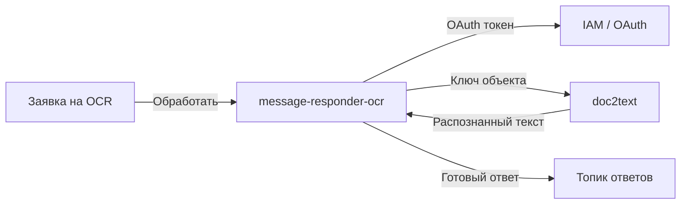
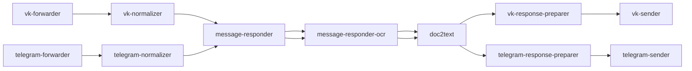

## О приложении

message-responder-ocr — промежуточный сервис, который подписывается на Kafka‑топик с заявками на OCR, забирает URL объекта в S3 и вызывает gRPC‑метод `doc2text`. После успешного распознавания он формирует текстовый ответ для пользователя и отправляет его дальше по цепочке.

## Роль приложения в архитектуре проекта

Компонент стоит между `message-responder` и `doc2text` в обеих ветках (VK/Telegram):


Он снимает нагрузку с остального пайплайна: получает OAuth‑токен по client credentials, подключается к `doc2text`, обрабатывает сетевые ошибки и гарантирует единый формат ответа. Благодаря этому `message-responder` может отвечать пользователю, не удерживая open‑loop, пока OCR работает.

## Локальный запуск

1. Требования: Go ≥ 1.24, доступ к Kafka и поднятый gRPC‑сервис `doc2text`, который доступен по TLS. Нужен OAuth‑провайдер (IAM) для получения токена.
2. Экспортируйте переменные:
   - Doc2text: `DOC3TEXT_G_RPC_URL` — адрес gRPC (`host:port`), `DOC3TEXT_ACCESS_TOKEN_URL` — endpoint IAM, `DOC3TEXT_CLIENT_ID_MESSAGE_RESPONDER_OCR` и `DOC3TEXT_CLIENT_SECRET_MESSAGE_RESPONDER_OCR`.
   - Kafka: `KAFKA_BOOTSTRAP_SERVERS_VALUE`, `KAFKA_GROUP_ID_MESSAGE_RESPONDER_OCR`, `KAFKA_TOPIC_NAME_OCR_REQUEST`, `KAFKA_TOPIC_NAME_TEMP_RESPONSE_PREPARER`, `KAFKA_CLIENT_ID_MESSAGE_RESPONDER_OCR`, опционально `KAFKA_SASL_USERNAME`/`KAFKA_SASL_PASSWORD`.
3. Запустите обработчик:
   ```bash
   go run ./cmd/msg-responder-ocr
   ```
   либо используйте контейнер `docker build -t message-responder-ocr .`.
4. Проверьте, что в логах присутствует соединение с Kafka и `doc2text`, а ответы прилетают в `<source><KAFKA_TOPIC_NAME_TEMP_RESPONSE_PREPARER>`.
